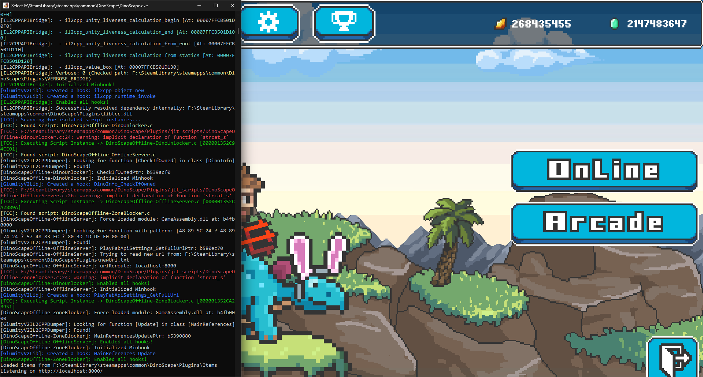

# GlumityToolSuite2 [](https://deepwiki.com/Glumboi/GlumityToolSuite2)
A work in progress, lightweight-ish suite for modifying il2cpp unity games

# Features/Startup steps
- A "version.dll" preloader
- A mainloader as "GlumityToolSuite2.dll"
- An IL2CPP runtime dumper as "GlumityV2IL2CPPDumper.dll" (it is more of a function pointer lookup helper than an actual dumper, might get expanded though)
- An IL2CPPAPIBridge as "IL2CPPAPIBridge.dll", this is essentially our runtime compiler, embeds a tcc enviornment tailored to work with GlumityV2

## Requirements
``` text
- Target Unity Game compiled with IL2CPP (x64 only atm).
- Windows 7 SP1 or higher (x64).
``` 

## Build-Requirements
``` text
- Odin programming language
- Xmake
- Microsoft Visual C++ 20 (c++20 was specified in xmake, older versions may be needed too though, just try what sticks)
```

## Build-Instructions - May become outdated soon-ish
``` text
- To build the MainLoader-Odin (GlumityToolSuite2.dll) go to "src/MainLoader-Odin/" and run the build.bat (output is within "src/MainLoader-Odin/build)"
- Everything else is built with a single "xmake" command inside the root folder, output is the "build" folder within the root folder, IMPORTANT: the IL2CPPDumper and IL2CPPAPIBridge will be inside "build/Plugins/"
```

# GlumityToolSuite2.dll
 - Works on its own already, heavily restricted and basically just a .dll loader - can be injected via the "version.dll" proxy or external tools, personal preference.
 
# Hooking IL2CPP code (using IL2CPPDumper and GlumityLib)
- Requires "GlumityV2IL2CPPDumper.dll" to be present within the "Plugins" folder, for examples of utilizing it, refer to [DemoPlugins](src/DemoPlugins) or to the example [JIT scripts](src/IL2CPPAPIBridge/default_bridge_env/jit_scripts)

# Hooking IL2CPP code (using IL2CPPAPIBridge and GlumityLib)
- "IL2CPPDumper.dll" in the "Plugins" folder and its requirements.
- A valid TCC enviornment, for structure, view "Directory Structure" 
(example [JIT scripts](src/IL2CPPAPIBridge/default_bridge_env/jit_scripts))

## Directory Structure
Upon first initialization, the suite creates or expects the following structural hierarchy inside the game directory:
```text
TargetGame/
├── GameAssembly.dll
├── version.dll                  	<- Proxy Preloader
├── GlumityToolSuite2.dll    		<- Main Mod Loader
└── Plugins/                 		<- Compiled Native DLL Plugins (.dll)
    ├── GlumityV2IL2CPPDumper.dll	
    └── IL2CPPAPIBridge.dll
	└── jit_scripts/ 		 		<- C Source Scripts (.c) compiled at runtime via TCC
	└── tcc_include/ 		
	|	└── include/ 		 		<- TCC include location (TCC here has a custom GlumityLib version, it can be changed how you want)
	└── tcc_libs/ 		 
		└── lib/ 		 			<- TCC library files location (e.g: user32.def, libtcc1-64.a)
```

# Important!

There might be some undocumented shenanigans going on, this project is pretty all over the place, I am aware of that and somewhat trying to mitigate it.
Due to it's nature though, it'll probably stay in this bad of a shape, the core project ([Glumity "V1"](https://github.com/Glumboi/GlumityToolSuite)) has started a couple years ago and did already suffer from similar things, this started out as Glumity V1 with a better dumper and has expanded quite since.


# Showcase

## IL2CPPGUILookup tutorial

[](https://www.youtube.com/embed/O3YJISban8k)

## [DinoScapeOffline](https://www.nexusmods.com/dinoscape/mods/1?tab=description) - adapted to the new TCC way of making mods!



